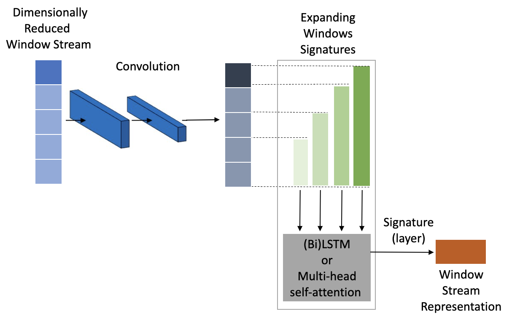

# SigNetworks: Sequential Path Signature Networks

SigNetworks (`sig-networks`) is a PyTorch package for training and evaluating
neural networks for longitudinal NLP classification tasks. `sig-networks` is a
library that applies models first developed in
[Sequential Path Signature Networks for Personalised Longitudinal Language Modeling](https://aclanthology.org/2023.findings-acl.310/)
by Tseriotou et al. (2023) which presented a novel extension of neural
sequential models using the notion of path signatures from rough path theory.

For more details of this library, see our EACL demo paper
[Sig-Networks Toolkit: Signature Networks for Longitudinal Language Modelling](https://aclanthology.org/2024.eacl-demo.24/).

For some quick examples without having to install anything on your personal
machine, we have a few examples on [Deepnote](https://deepnote.com/) - you will
need to duplicate the project to run it yourself though:

- [SWNU Network example on Anno-MI dataset](https://deepnote.com/workspace/longnlp-c56d99b4-d42f-4567-a886-b7583212b165/project/Rumour-Networks-Tutorial-85a9b1ef-1102-48ff-af03-1cd5696a5b12/notebook/Anno-MI%20SWNU%20example-273cd08b2204442f9da73a8f2e22080b)

## Installation

SigNetworks is available on PyPI and can be installed with pip:

```bash
pip install sig_networks
```

Note that currently `sig_networks` only supports Python 3.8 since it relies on
the [`signatory`](https://github.com/patrick-kidger/signatory) library. However,
it is possible to install `signatory` with more recent Python and PyTorch
versions if you install it from source. See the installation guide in the
[signatory documentation](https://signatory.readthedocs.io/en/latest/pages/usage/installation.html)
for more details.

### Signatory/Torch

SigNetworks depends on the
[`patrick-kidger/signatory`](https://github.com/patrick-kidger/signatory)
library for differentiable computation of path signatures/log-signatures in
PyTorch. Please see the
[signatory documentation](https://signatory.readthedocs.io/en/latest/) for
installation instructions of the signatory library.

A common `signatory` installation issue is that the installation requires that
you already have PyTorch installed. In this case, you can try the following:

```bash
# install PyTorch
pip install torch==1.9.0
# install signatory
pip install signatory==1.2.6.1.9.0
# install sig_networks
pip install sig_networks
```

If you encounter any issues with the installation of `signatory`, please see the
FAQs in the
[signatory documentation](https://signatory.readthedocs.io/en/latest/pages/miscellaneous/faq.html).

## Repo structure

The key parts of the libary are found in [`src/`](src/):

- [`src/sig_networks/`](src/sig_networks/) contains the source code for the
  models and includes PyTorch modules for the various components of the models
  (see below for more usage details)
- [`src/scripts/`](src/scripts/) contains some helper scripts for training and
  evaluating the models

## Usage

The key components in the _signature-window_ models presented in (see
[Sequential Path Signature Networks for Personalised Longitudinal Language Modeling](https://aclanthology.org/2023.findings-acl.310/)
for full details) are written as PyTorch modules which can be used in a modular
fashion. The key components are:

- The Signature Window Network Units (SWNUs):
  [`sig_networks.SWNU`](src/sig_networks/swnu.py)
  - There also exists the SWLSTM module which does not include the
    1D-convolution layer at the start of the SWNU:
    [`sig_networks.SWLSTM`](src/sig_networks/swnu.py)
- The Signature Window (Multihead-)Attention Units (SWMHAUs):
  [`sig_networks.SWMHAU`](src/sig_networks/swmhau.py)
  - As with the SWNU, there also exists the SWMHA module which does not include
    the 1D-convolution layer at the start of the SWMHAU:
    [`sig_networks.SWMHA`](src/sig_networks/swmhau.py)
- The SWNU-Network model:
  [`sig_networks.SWNUNetwork`](src/sig_networks/swnu_network.py)
- The SWMHAU-Network model:
  [`sig_networks.SWMHAUNetwork`](src/sig_networks/swmhau_network.py)
- The SeqSigNet model:
  [`sig_networks.SeqSigNet`](src/sig_networks/seqsignet_bilstm.py)
- The SeqSigNet-Attention-Encoder model:
  [`sig_networks.SeqSigNetAttentionEncoder`](src/sig_networks/seqsignet_attention_encoder.py)
- The SeqSigNet-Attention-BiLSTM model:
  [`sig_networks.SeqSigNetAttentionBiLSTM`](src/sig_networks/seqsignet_attention_bilstm.py)

Also see our demo paper
[Sig-Networks Toolkit: Signature Networks for Longitudinal Language Modelling](https://arxiv.org/abs/2312.03523)
for details of each of these model components.

### `nlpsig`: Preparing the data

The functionality to prepare the data for the SW-models and constructing paths
and inputs are found in the [`nlpsig`](https://github.com/datasig-ac-uk/nlpsig)
library which can be easily installed using `pip` and comes as a dependency in
`sig-networks`.

Paths can be constructed using the
[`nlpsig.PrepareData`](https://nlpsig.readthedocs.io/en/latest/data_preparation.html)
class. Furthermore, there is functionality within the
[`nlpsig.TextEncoder`](https://nlpsig.readthedocs.io/en/latest/encode_text.html#nlpsig.encode_text.TextEncoder)
and
[`nlpsig.SentenceEncoder`](https://nlpsig.readthedocs.io/en/latest/encode_text.html#nlpsig.encode_text.SentenceEncoder)
classes to obtain embeddings using transformers to be used as the channels in
the paths. Since we want to take path signatures within the SW-models, we need
to ensure that the number of channels in the path are low enough that we can
take the path signatures efficiently. To enable this, there are also a number of
dimensionality reduction methods in the `nlpsig` library - see
[`nlpsig.DimReduce`](https://nlpsig.readthedocs.io/en/latest/dimensionality_reduction.html).

For full details, see the
[`nlpsig` GitHub repo](https://github.com/datasig-ac-uk/nlpsig) and there are
examples of using the library in the [`examples/`](examples/) directory.

Note that for obtaining inputs to the SWNU-/SWMHA-Networks and the SeqSigNet
family models, there are helper functions in the scripts (see e.g.
`obtain_SWNUNetwork_input` in
[`src/scripts/swnu_network_functions.py`](src/scripts/swnu_network_functions.py)
and `obtain_SeqSigNet_input` in
[`src/scripts/seqsignet_functions.py`](src/scripts/seqsignet_functions.py)).
There is also examples run-throughs in the [`examples/`](examples/) directory:

- [Training a SWNU-Network model for Anno-MI client-talk-type prediction](examples/AnnoMI/anno_mi-client-swnu-example.ipynb)
  - Note that this notebook is also on [Deepnote](https://deepnote.com/):
    [Anno-MI SWNU example](https://deepnote.com/workspace/longnlp-c56d99b4-d42f-4567-a886-b7583212b165/project/Rumour-Networks-Tutorial-85a9b1ef-1102-48ff-af03-1cd5696a5b12/notebook/Anno-MI%20SWNU%20example-273cd08b2204442f9da73a8f2e22080b)
  - Note that you will need to duplicate the project so that you can run the
    notebook yourself
- [Training a SeqSigNet model for Anno-MI client-talk-type prediction](examples/AnnoMI/anno_mi-client-seqsignet-example.ipynb)

### Using the SWNU and SWMHAU modules

The Signature Window units (SWNU and SWMHAU) accept a batch of streams and
returns a batch of feature representations.



For example:

```python
from sig_networks.swnu import SWNU
import torch

# initialise a SWNU object
swnu = SWNU(
    input_channels=10,
    hidden_dim=5,
    log_signature=False,
    sig_depth=3,
    pooling="signature",
    BiLSTM=True,
)

# create a three-dimensional tensor of batched streams
# shape [batch, length, channels] where channels = 10
streams = torch.randn(2, 20, 10)

# pass the streams through the SWNU
features = swnu(streams)

# features is a two-dimensional tensor of shape [batch, signature_channels]
features.shape
```

The SWMHAU is similar to the SWNU, but rather than having an LSTM to process the
signature streams, we have a multihead-attention layer. For example:

```python
from sig_networks.swmhau import SWMHAU
import torch

# initialise a SWMHAU object
swmhau = SWMHAU(
    input_channels=10,
    output_channels=5,
    log_signature=False,
    sig_depth=3,
    num_heads=5,
    num_layers=1,
    dropout_rate=0.1,
    pooling="signature",
)

# create a three-dimensional tensor of batched streams
# shape [batch, length, channels] where channels = 10
streams = torch.randn(2, 20, 10)

# pass the streams through the SWMHAU
features = swmhau(streams)

# features is a two-dimensional tensor of shape [batch, signature_channels]
features.shape
```

Note in the above, we used the `pooling="signature"` option. This means that at
the end of the SWNU/SWMHAU, we will take a final signature of the streams to get
a fixed-length feature representation for each item in the batch. There are
other options such as taking the final LSTM hidden state for SWNU (set
`pooling="lstm"`), or using a CLS pooling for SWMHAU (set `pooling="cls"`).
There is another option where `pooling=None` which means that the SWNU/SWMHAU
where no pooling is applied at the end of the SWNU/SWMHAU and the output is a
three-dimensional tensor of shape `[batch, length, hidden_dim]`.

### Using the network models

The library also has the SWNU-Network and SeqSigNet models as introduced in
[Sequential Path Signature Networks for Personalised Longitudinal Language Modeling](https://aclanthology.org/2023.findings-acl.310/).

Since then, there have been developments of other models which utilise the SWNUs
and SWMHAUs discussed above. Each of these models are avaliable as PyTorch
modules which can be initialised and trained in the usual way.

For SWNU-Network and SWMHAU-Network models, they expect two inputs:

1. `path`: a batch of streams of shape `[batch, length, channels]` - these get
   processed by the SWNU/SWMHAU
2. `features`: a batch of features of shape `[batch, features]` - these get
   concatenated with the output of the SWNU/SWMHAU to be fed into a FFN layer

For SeqSigNet models (e.g. SeqSigNet, SeqSigNet-Attention-Encoder,
SeqSigNet-Attention-BiLSTM), they also expect two inputs but the path is
slightly different:

1. `path`: a batch of streams of shape `[batch, units, length, channels]` - each
   of the units for each batch will get processed by the SWNU/SWMHAU.
   Afterwards, there is a global network to process the outputs of the
   SWNU/SWMHAU in order to pool the outputs into a single fixed-length feature
   represenation for the history. The global network can either be a BiLSTM (in
   the case of SeqSigNet and SeqSigNet-Attention-BiLSTM) or a Transformer
   Encoder (in the case of SeqSigNet-Attention-Encoder).
2. `features`: a batch of features of shape `[batch, features]` - these get
   concatenated with the output of the global network (either BiLSTM or a
   Transformer Encoder) that processes the outputs of SWNU and SWMHAU to be fed
   into a FFN layer

### Example experiments

In the [`examples/`](examples/) directory, there are some example experiments
using the library to comapre the SW-models with other baseline models such as a
simple FFN, a BiLSTM model on the sentence-transformer representations and using
a pre-trained Transformer model for classification.

## Pre-commit and linters

To take advantage of `pre-commit`, which will automatically format your code and
run some basic checks before you commit:

```
pip install pre-commit  # or brew install pre-commit on macOS
pre-commit install  # will install a pre-commit hook into the git repo
```

After doing this, each time you commit, some linters will be applied to format
the codebase. You can also/alternatively run `pre-commit run --all-files` to run
the checks.
